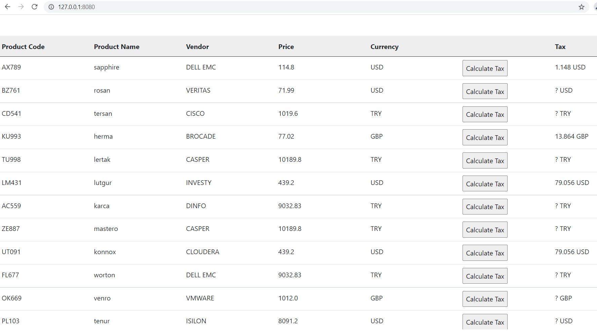
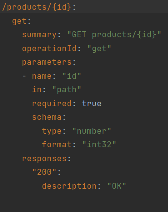

# Backend Coding Challenge

This work up is intended to show a broad array of topics of full stack technologies, mostly of the backend parts. It is also aimed to demonstrate the learnings of how to implement the less experienced technologies.

## Prerequisites

- Create an ``.env`` file on the root directory and it must include the variables of the MySQL and MongoDB credientials:
  ``MYSQL_USERNAME``, ``MYSQL_PASSWORD``, ``MONGO_DB``, ``MONGO_ROOT_USERNAME``, ``MONGO_ROOT_PASSWORD``, ``MONGO_DB_USERNAME``, and ``MONGO_DB_PASSWORD`` .

## Installing Docker Compose

Before starting, [install Docker Compose](https://docs.docker.com/compose/install/)

## Starting the program
Run the program via the command:
```bash
docker-compose up
```
- ``product-service`` occupies [127.0.0.1:8080](http://127.0.0.1:8080/) and go to [127.0.0.1:8080](http://127.0.0.1:8080/) for the frontend part of ``product-service``.
- ``mysqldb`` service occupies ``127.0.0.1:3308`` for being data source of the backend part of ``product-service``.
- ``phpmyadmin`` occupies [127.0.0.1:8085](http://127.0.0.1:8085/) and go to [127.0.0.1:8085](http://127.0.0.1:8085/) for having any graphical interaction with ``mysqldb``.
- ``tax-service`` occupies [127.0.0.1:8090](http://127.0.0.1:8090/) .
- ``mongo-db`` service occupies ``127.0.0.1:27017`` for being data storing source of the backend part of ``tax-service``.




## Endpoints
###product-service (http://127.0.0.1:8080)
- 
- 
- 
- 
- 
- 
- 
- 
- 
- 
- 


###tax-service (http://127.0.0.1:8090)
- 

## Contact
Pull requests are welcome. You can also email to korkusuzs18@itu.edu.tr
